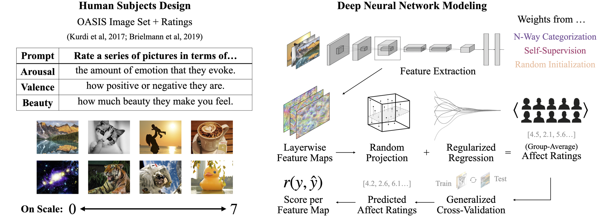

# Affect Ex Machina



Experiments in the use of deep neural network models to predict human affect, including source code and data for the [paper](https://www.pnas.org/doi/abs/10.1073/pnas.2306025121): 

> *The perceptual primacy of feeling: Affectless visual machines explain a majority of variance in human visually evoked affect* (PNAS, 2025)

## Citation

```bibtex
@article{conwell2025perceptual,
  title={The perceptual primacy of feeling: Affectless visual machines explain a majority of variance in human visually evoked affect},
  author={Conwell, Colin and Graham, Daniel and Boccagno, Chelsea and Vessel, Edward A},
  journal={Proceedings of the National Academy of Sciences},
  volume={122},
  number={4},
  pages={e2306025121},
  year={2025},
  publisher={National Academy of Sciences} 
}
```

The psyarxiv preprint version(s) of the paper are available [at this link](https://osf.io/preprints/psyarxiv/5wg4s).